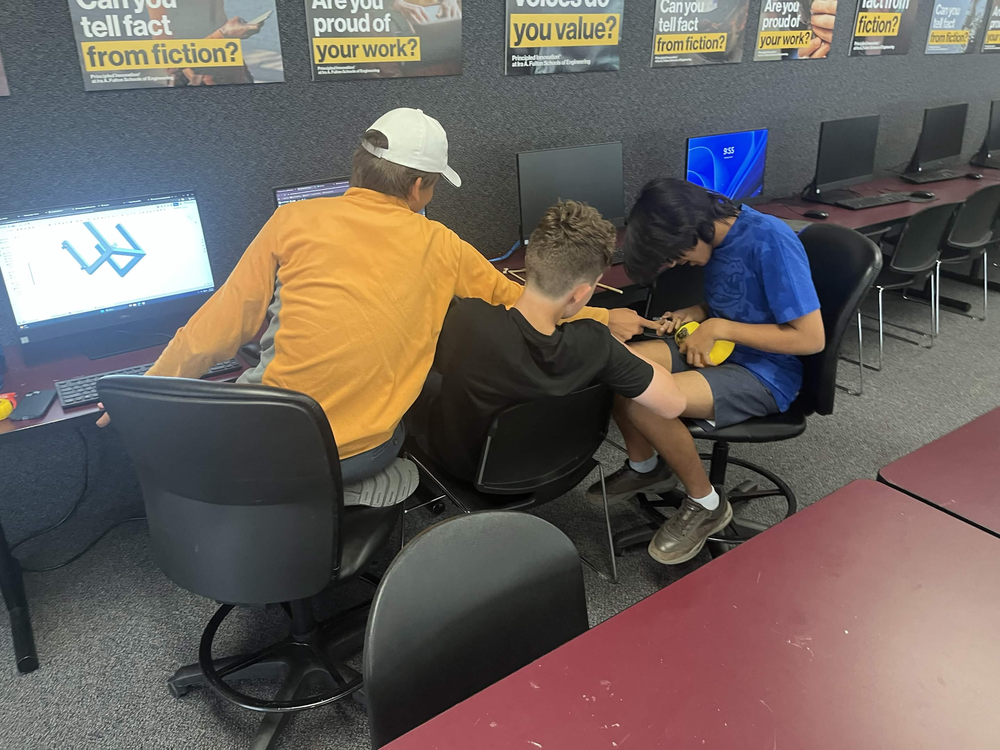
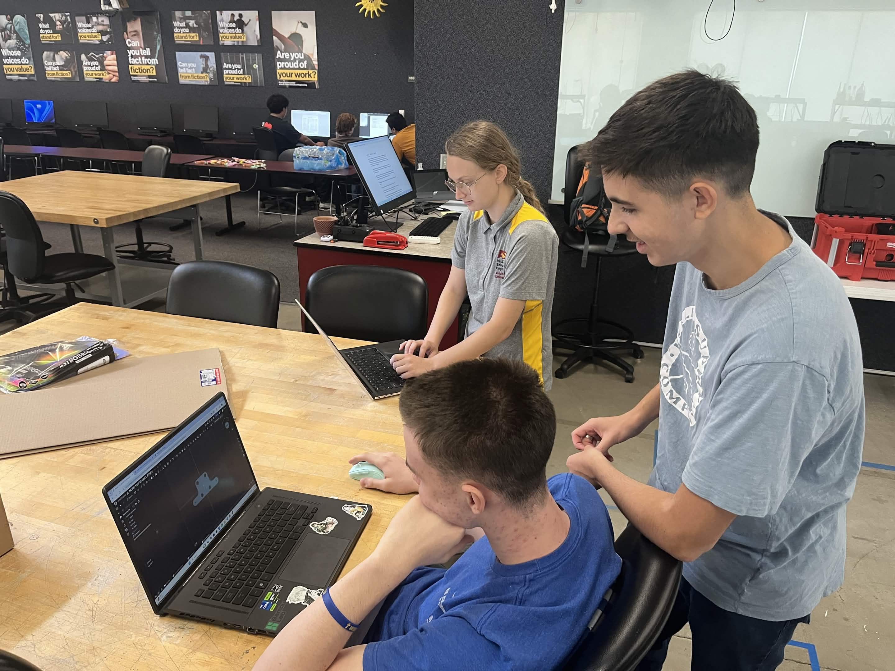
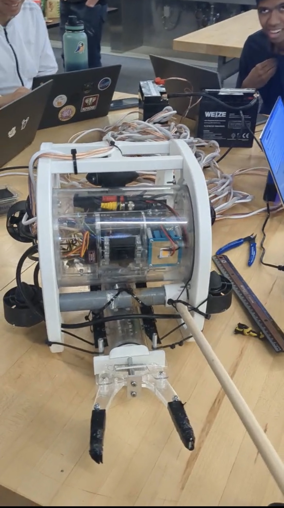

# NURC Underwater ROV Control Systems

**National Underwater Robotics Challenge: Dual-Platform Firmware Repository**

Professional control firmware for two independent ROV platforms developed for pool mission operations, engineering education, and competition documentation. Each platform consists of matched **top-side** (operator box) and **bottom-side** (vehicle) Teensy 4.x programs communicating over RS-485.

> **Important:** BOT1 and BOT2 are **separate systems**. Flash `Bot1Top` with `Bot1Bottom`, or `Bot2Top` with `Bot2Bottom`. Do not mix pairs.

---

## Overview

This repository contains the complete Arduino firmware for the team's NURC ROVs:

- **BOT1**: Original ROVotron Cadet platform with manual depth control and legacy gripper hardware.
- **BOT2**: Second-generation platform with PID depth hold, slow mode, input slew limiting, and an RC servo claw.

Both systems accept **Xbox One** gamepad input at a surface control box, display telemetry on a **4x20 LCD**, and command thrusters, lighting, and manipulators on the vehicle over a **tethered RS-485** link.

---

## About NURC

The [National Underwater Robotics Challenge (NURC)](https://www.nurc.us/) engages students in designing, building, and operating underwater robots for mission-based pool competition. Events emphasize:

- **Mission execution**: precision driving, manipulation, and task completion under time pressure
- **Engineering communication**: documentation, oral defense, and design rationale
- **Hands-on learning**: electronics, programming, hydrodynamics, and teamwork

Mission props and layouts are published on the [NURC mission props page](https://www.nurc.us/misson-props). Event briefings and archives appear on the [NURC webcast page](https://www.nurc.us/webcast).

---

## Robot Lineage

### BOT1

**Overview.** First competition ROV built on the ROVotron Cadet architecture. Proven manual piloting with six-thruster mixing and dual-PWM gripper actuation.

**Key features.**

- Xbox One to thruster mixing (drive, strafe, steer, dive)
- Dual complementary PWM gripper (pins 9/10)
- Camera tilt servo (pin 21)
- Pressure depth **display** (no closed-loop hold)
- 20 Hz command rate, RS-485 hex protocol

**Hardware.** Teensy 4.x top box; Teensy 4.0 bottom controller; five BlueRobotics-style ESCs; analog pressure on A6; battery and temperature ADC channels.

**Software.** `Bot1Top/Bot1TOP.ino` + `Bot1Bottom/Bot1Bottom.ino`.

**Role.** Baseline platform; established control mapping and tether protocol for the team.

### BOT2

**Overview.** Evolutionary redesign retaining the ROVotron communication model while adding operator-assist and safety-oriented control features.

**Key features.**

- **PID depth hold** after vertical stick release (top-side)
- **Slow mode** (LB + RB toggle) with slew-limited sticks
- **RC claw servo** with rate limiting (replaces dual PWM gripper)
- Checksum-validated commands on bottom
- LCD: slow mode, calibrated depth, PID status

**Hardware.** Shared thruster pinout with BOT1; claw on pin 21; camera tilt on pin 17 (firmware disabled); LED dim on pin 22.

**Software.** `Bot2Top/Bot2Top.ino` + `Bot2Bottom/Bot2Bottom.ino`.

**Role.** Primary mission platform with improved depth stability and fine maneuvering.

---

## System Architecture

| Layer | Component | Responsibility |
|-------|-----------|----------------|
| Top | Teensy + USB Host | Gamepad input, mixing, LCD, command transmit |
| Link | RS-485 @ 115200 | Half-duplex ASCII hex packets on tether pair |
| Bottom | Teensy 4.0 | ADC telemetry, ESC/servo outputs, reply transmit |

See [docs/architecture.md](docs/architecture.md) for data-flow diagrams and subsystem tables.

---

## Hardware Overview

| Subsystem | Description |
|-----------|-------------|
| **Frame** | Competition ROV frame (team-built; see build notes) |
| **Propulsion** | 5 ESC thrusters + strafe; vertical/horizontal mix |
| **Control electronics** | Dual Teensy stack, RS-485 transceiver |
| **Sensors** | 12-bit ADC: battery, temps, analog pressure depth |
| **Camera** | Tilt servo (BOT1 active; BOT2 disabled in firmware) |
| **Lighting** | PWM-dimmable LED (pin 22) |
| **Tether** | RJ45 carrying RS-485 data and power |
| **Power** | Onboard battery with top-side voltage display |
| **Manipulator** | BOT1 dual PWM grip / BOT2 RC claw servo |

Pin tables: [docs/hardware-mapping.md](docs/hardware-mapping.md). Control board schematic: [assets/Gripper Photos/RVCBOT-D-schem.pdf](assets/Gripper%20Photos/RVCBOT-D-schem.pdf).

---

## Software Architecture

| Function | Location | Notes |
|----------|----------|-------|
| Controller input | Top | Xbox sticks/triggers to analogs[] |
| Communication | Both | `M...P...S...C` commands; `V...` telemetry |
| Thruster control | Both | Top mixes; bottom scales to ESC us |
| Telemetry | Bottom to Top | Smoothed ADC to hex to LCD |
| Depth hold | BOT2 top only | PID on filtered pressure |
| Failsafes | Both | Parse rejection; BOT2 hold disengage |
| Display | Top | 4x20 LCD telemetry |

Details: [docs/control-systems.md](docs/control-systems.md), [docs/communication.md](docs/communication.md).

---

## BOT1 vs BOT2

| Category | BOT1 | BOT2 |
|----------|------|------|
| **Hardware** | Dual PWM gripper; camera on 21 | RC claw on 21; camera pin 17 (off) |
| **Software** | Manual depth; no slew | PID hold, slow mode, slew limits |
| **PID** | None | Top-side depth PID |
| **Gripper** | Trigger differential to dual PWM | Latched cmd to servo slew |
| **Camera** | Active servo | Disabled (`CAMERA_TILT_ENABLED 0`) |
| **Steering** | Standard mix | Drive pitch trim on vertical |
| **Depth** | Display only | Hold + filtered telemetry |
| **Safety** | Checksum not enforced | Checksum + sensor validation |
| **Telemetry** | Battery, depth, temps | Slow mode and PID lines |

Full comparison: [docs/bot1-vs-bot2.md](docs/bot1-vs-bot2.md).

---

## Safety Systems

- **Invalid packets**: Bottom skips actuator updates on parse failure; BOT2 verifies checksum.
- **PID disengagement (BOT2)**: Stick input, bad sensor, gamepad loss, or telemetry timeout disables hold.
- **ESC startup**: 7 s neutral arming before accepting commands (bottom).
- **Claw slew (BOT2)**: Limits pulse change rate to reduce mechanical and electrical stress.

Full analysis: [docs/safety-and-failsafes.md](docs/safety-and-failsafes.md).

---

## Build Process

Robots were developed iteratively from ROVotron Cadet firmware through RVCBOT hardware revisions. BOT2 added top-side closed-loop depth and bottom-side comm integrity based on pool testing lessons.

Construction notes, calibration guidance, and competition checklist: [docs/build-notes.md](docs/build-notes.md).

---

## Media

Team photos, prototype renders, gripper development images, and pool testing video live in [`assets/`](assets/).

### Team


*NURC team at competition preparation.*


*Team members with the ROV control system.*


*Pool-side engineering review.*


*Competition readiness.*

### Prototype


*Early frame and thruster layout concept.*


*Updated mechanical configuration.*

### Gripper and Claw (BOT2)

.jpg)
*RC claw hardware for BOT2 manipulator.*

.jpg)
*Claw mounting detail.*

.jpg)
*Servo linkage.*

.jpg)
*Closed configuration.*

.jpg)
*Open configuration.*

.jpg)
*Side profile.*

.jpg)
*Integration with frame.*

.jpg)
*Wiring clearance.*

.jpg)
*Final competition configuration.*

### Video

[Pool functionality test (MOV)](assets/TeamProto/Functionality_1.mov)
*End-to-end drive, depth, and manipulator check.*

---

## External References

| Resource | Link |
|----------|------|
| Team design document | [Google Drive PDF](https://drive.google.com/file/d/1L6_iDUZlUk_yECLHYrSY6R8Uuk5SJSd_/view) |
| NURC competition video | [YouTube](https://www.youtube.com/watch?v=rPA1AVYUPB4) |
| Engineering notebook | [Google Drive PDF](https://drive.google.com/file/d/14MQay8u6-zPsZq1d81uaRiCIRHpb4kXX/view) |
| Mission props | [nurc.us/misson-props](https://www.nurc.us/misson-props) |
| Event webcast | [nurc.us/webcast](https://www.nurc.us/webcast) |
| Extended event footage | [YouTube (timestamped)](https://www.youtube.com/watch?v=SjvaYA--C2E&t=2877s) |
| NURC technical guide | [PDF](https://www.nurc.us/_files/ugd/eef06b_07dbf7a7e38846dd99ce8ee371aaa77c.pdf) |
| NURC rules supplement | [PDF](https://www.nurc.us/_files/ugd/eef06b_d78cf4c836dd4652ab6865190903f68d.pdf) |
| Additional reference | [PDF](https://d569481b-2ac7-4514-8c0f-517c91c9a490.filesusr.com/ugd/388f5b_8723b7db377f43c18f3086b1416dc54b.pdf) |

---

## Documentation Index

| Document | Description |
|----------|-------------|
| [architecture.md](docs/architecture.md) | System architecture and data flow |
| [bot1-vs-bot2.md](docs/bot1-vs-bot2.md) | Platform comparison |
| [communication.md](docs/communication.md) | RS-485 packet format |
| [control-systems.md](docs/control-systems.md) | Gamepad mapping and mixing |
| [pid-depth-hold.md](docs/pid-depth-hold.md) | BOT2 depth PID (top-side) |
| [hardware-mapping.md](docs/hardware-mapping.md) | Pin and actuator tables |
| [telemetry-and-lcd.md](docs/telemetry-and-lcd.md) | Sensors and display |
| [safety-and-failsafes.md](docs/safety-and-failsafes.md) | Safety behavior |
| [build-notes.md](docs/build-notes.md) | Construction and lessons learned |

---

## Repository Layout

```
Bot1Top/Bot1TOP.ino        BOT1 top-side firmware
Bot1Bottom/Bot1Bottom.ino  BOT1 bottom-side firmware
Bot2Top/Bot2Top.ino        BOT2 top-side firmware
Bot2Bottom/Bot2Bottom.ino  BOT2 bottom-side firmware
docs/                      Engineering documentation
assets/                    Team photos, prototypes, gripper media
README.md                  This file
```

---

## Repository History

This project continues development from the [UnderwaterRobotics-Camp-2026](https://github.com/sophie-boyce/UnderwaterRobotics-Camp-2026) camp repository. Prior commits record camp prototypes and iteration; the current tree replaces that content with the NURC competition firmware baseline, full documentation set, and team assets.

---

## Quick Start (Developers)

1. Install [Teensyduino](https://www.pjrc.com/teensy/td_download.html) for Arduino 2.x.
2. Install libraries: `LiquidCrystalFast`, `USBHost_t36`, `Servo` (Teensy core).
3. Select **Teensy 4.1** (top) or **Teensy 4.0** (bottom) in Arduino IDE.
4. Flash the **matched pair** for your platform.
5. BOT2: calibrate depth constants in `Bot2Top.ino` at your pool (`DEPTH_*` defines).

---

## License and Attribution

Firmware derives from ROVotron Cadet programs (C) David Forbes, 2010, 2023-2024. Team adaptations documented in sketch revision histories.

---

*Documentation generated from repository source code. Runtime behavior is defined solely by the `.ino` sketches.*
