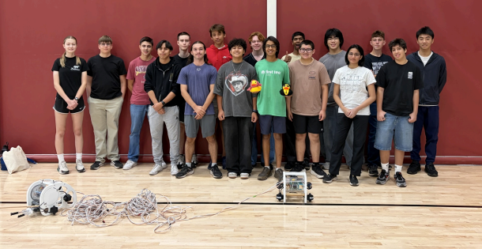
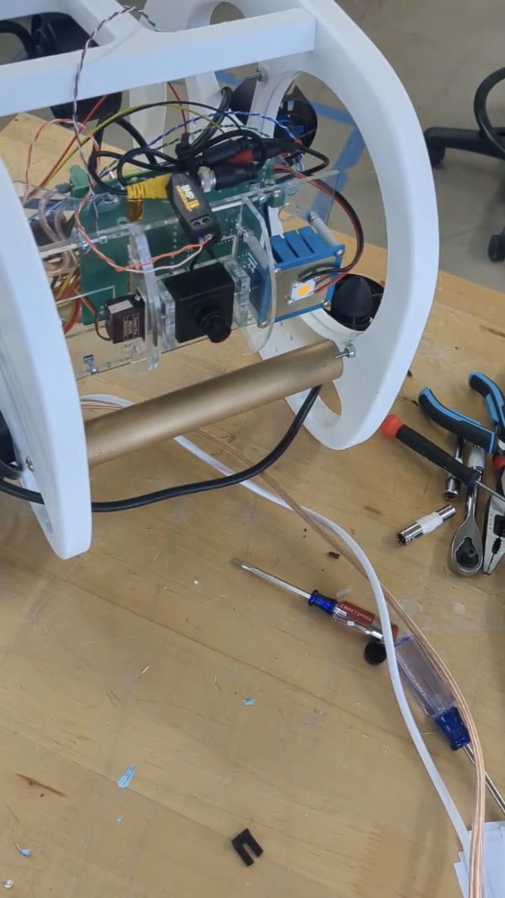
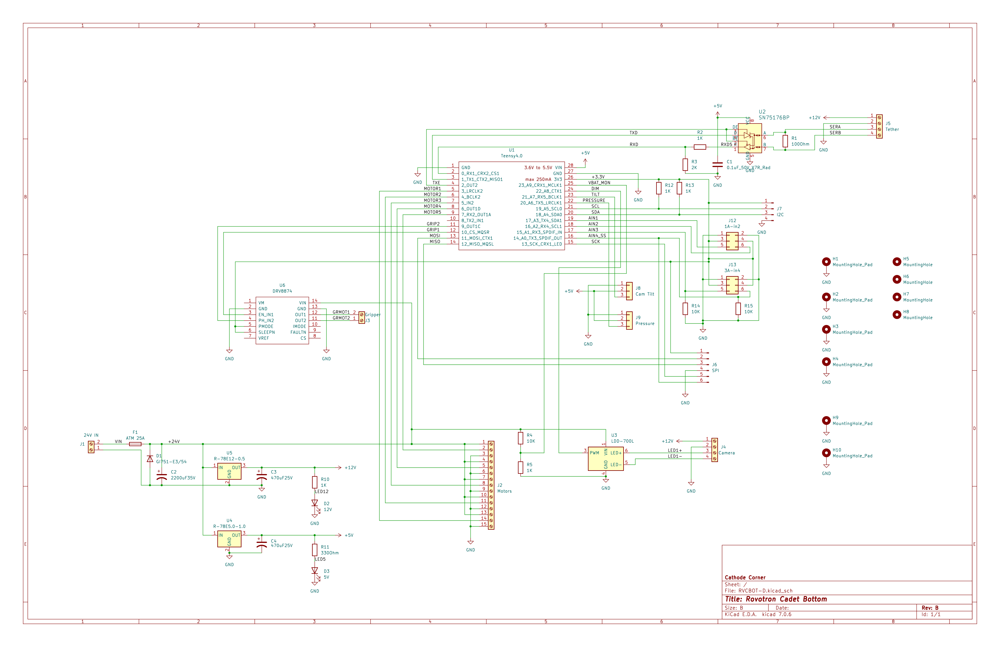
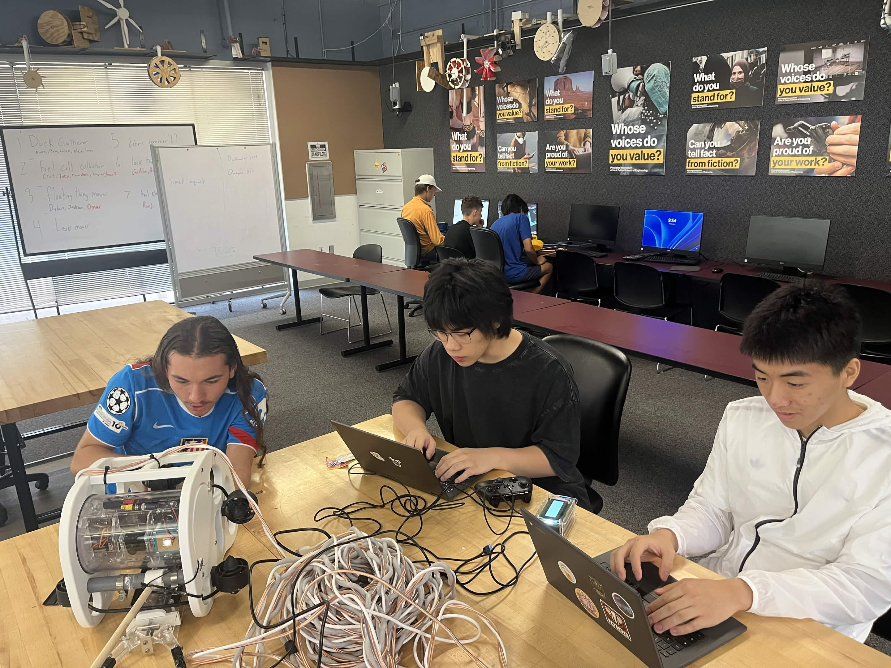
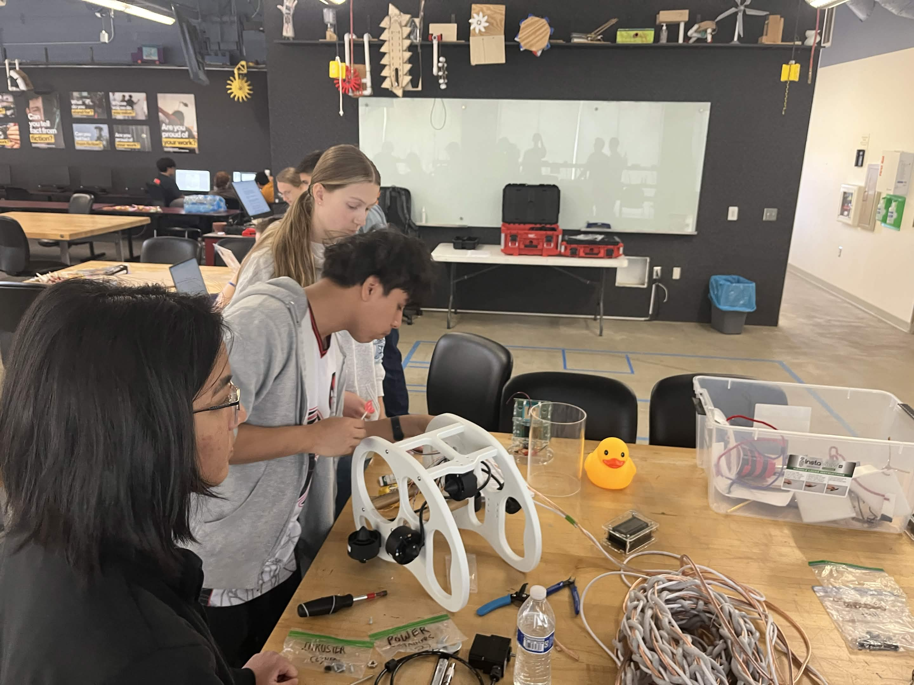

<h1 align="center">NURC Underwater ROV</h1>

  <strong>Built at the ASU Underwater Robotics Camp, competed at the National Underwater Robotics Challenge</strong> 
  Arizona State University · ASU Underwater Robotics Camp

  

<em>Our competition ROV after camp build-out: frame, claw, thrusters, and tether.</em>

This repository holds the firmware, documentation, and build media for the robots our team designed and operated during the **2026 ASU Underwater Robotics Camp** and the **National Underwater Robotics Challenge (NURC)**.

> **Flash matched pairs only:** `Bot1Top` + `Bot1Bottom`, or `Bot2Top` + `Bot2Bottom`. BOT1 and BOT2 are separate platforms.

---

## Where This Project Started 

### ASU Underwater Robotics Camp

Our team came together through the [ASU Underwater Robotics Camp](https://eoss.asu.edu/summer-program/asu-underwater-robotics-camp), a week-long program hosted by Arizona State University's Fulton Schools of Engineering at the **Polytechnic campus** (June 2-7, 2026).

Over the week we worked alongside other high school students to **design, wire, program, and test** a real underwater robot. Faculty and mentors guided us through buoyancy, electrical systems, controls, and how to think like engineers when something fails in the pool. We also connected with **Desert WAVE**, ASU's top-ranked underwater robotics team, and saw what competitive ROV work looks like at a high level.

### The National Underwater Robotics Challenge

[NURC](https://www.nurc.us/) is a student underwater robotics competition held in Arizona. Teams pilot tethered ROVs in a mission pool, complete task-based runs, and explain their engineering choices to judges.

**2026 theme: Duckie Disaster.** The mission scenario is a simulated Pacific maritime emergency. Teams deploy their ROVs to:

- Recover scattered rubber duckies and other mission objects
- Remove or secure hazardous containers
- Inspect and document damage to fragile reef structures
- Work within time limits while keeping control of depth, position, and the manipulator

That scenario drove many of our design choices: a reliable claw, stable depth control, slow and precise driving modes, and a control box that gives the operator clear feedback.

Mission props, field layouts, and rules are published on the [NURC mission props page](https://www.nurc.us/misson-props). Event handbooks and judging materials are on [nurc.us](https://www.nurc.us/rules).

---

## Our Robots

We competed with two related platforms developed across camp and pool testing:

| | **BOT1** | **BOT2** |
|---|----------|----------|
| **Role** | Original camp robot; manual piloting | Refined competition robot |
| **Depth** | Operator controls depth with the stick | Automatic depth hold after stick release |
| **Gripper** | Dual-motor gripper | RC servo claw with smooth, limited motion |
| **Operator aids** | Straightforward mapping | Slow mode, input smoothing, LCD status |

BOT1 established our control layout and tether protocol. BOT2 added the features we needed for repeatable mission runs: holding depth while the operator focused on position and the claw, and fine control when working near props.

Detailed firmware notes live in [`docs/`](docs/). This README stays focused on the story, the build, and the photos.

---

## The Robot (Design and Build)

  

  <em>Internal layout during assembly: camera, control board, wiring, and thruster mounts.</em>

The ROV follows the **ROVotron Cadet** kit architecture: a surface **control box** (Xbox controller, LCD, tether connection) and a **vehicle board** that drives thrusters, lighting, sensors, and the manipulator. A single tether carries power and data between them.

During camp we iterated on frame layout, claw mounting, and how the robot behaved in the water. BOT2 reflects what we learned: steadier depth, a claw that could grab duckies without snapping, and software safeguards so a bad packet or lost sensor reading would not fight the operator.

### Control and wiring

  

  <em>Vehicle control board wiring overview (Teensy, ESCs, sensors, and actuator paths).</em>
  &nbsp;|&nbsp;
  <a href="assets/Gripper%20Photos/RVCBOT-D-schem.pdf">PDF schematic (RVCBOT-D)</a>

---

## The Team

  
  &nbsp;&nbsp;
  

<em>Our camp and competition team with the ROV and control station.</em>

---

## Claw Development (BOT2)

The mission claw went through several mechanical revisions before competition. These photos document the final servo-driven design mounted on BOT2.

  
  
  

  
  
  

  
  
  

<em>Claw assembly, linkage, and mounting across build iterations.</em>

---

## Pool Testing

[Functionality test video (MOV)](assets/TeamProto/Functionality_1.mov): drive, depth, and manipulator check before mission runs.

---

## Repository Contents

| Path | Description |
|------|-------------|
| `Bot1Top/`, `Bot1Bottom/` | BOT1 surface and vehicle firmware |
| `Bot2Top/`, `Bot2Bottom/` | BOT2 surface and vehicle firmware |
| `docs/` | Architecture, controls, safety, and hardware reference |
| `assets/` | Team photos, renders, claw build photos, schematics |

---

## Documentation

| Document | Topic |
|----------|-------|
| [architecture.md](docs/architecture.md) | System layout and data flow |
| [bot1-vs-bot2.md](docs/bot1-vs-bot2.md) | Platform comparison |
| [communication.md](docs/communication.md) | Tether packet format |
| [control-systems.md](docs/control-systems.md) | Gamepad and thruster mapping |
| [pid-depth-hold.md](docs/pid-depth-hold.md) | BOT2 depth hold |
| [hardware-mapping.md](docs/hardware-mapping.md) | Pins and actuators |
| [telemetry-and-lcd.md](docs/telemetry-and-lcd.md) | Sensors and display |
| [safety-and-failsafes.md](docs/safety-and-failsafes.md) | Safety behavior |
| [build-notes.md](docs/build-notes.md) | Construction and lessons learned |

---

## External References

| Resource | Link |
|----------|------|
| ASU Underwater Robotics Camp | [eoss.asu.edu](https://eoss.asu.edu/summer-program/asu-underwater-robotics-camp) |
| NURC home | [nurc.us](https://www.nurc.us/) |
| Mission props | [nurc.us/misson-props](https://www.nurc.us/misson-props) |
| Team design document | [Google Drive PDF](https://drive.google.com/file/d/1L6_iDUZlUk_yECLHYrSY6R8Uuk5SJSd_/view) |
| Engineering notebook | [Google Drive PDF](https://drive.google.com/file/d/14MQay8u6-zPsZq1d81uaRiCIRHpb4kXX/view) |
| Competition trailer | [YouTube](https://www.youtube.com/watch?v=rPA1AVYUPB4) |
| Competition video | [YouTube](https://www.youtube.com/watch?t=2877&v=SjvaYA--C2E) |
| Event webcast | [nurc.us/webcast](https://www.nurc.us/webcast) |

---

## Quick Start (Developers)

1. Install [Teensyduino](https://www.pjrc.com/teensy/td_download.html).
2. Libraries: `LiquidCrystalFast`, `USBHost_t36`, `Servo`.
3. Flash **Teensy 4.1** (top) or **Teensy 4.0** (bottom) for your platform pair.
4. BOT2: calibrate depth at your pool (`DEPTH_*` defines in `Bot2Top.ino`).

---

## Attribution 

Firmware derives from ROVotron Cadet programs (C) David Forbes, 2010, 2023-2024. Team adaptations are documented in sketch revision histories.
