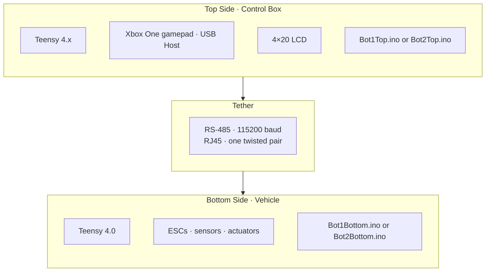
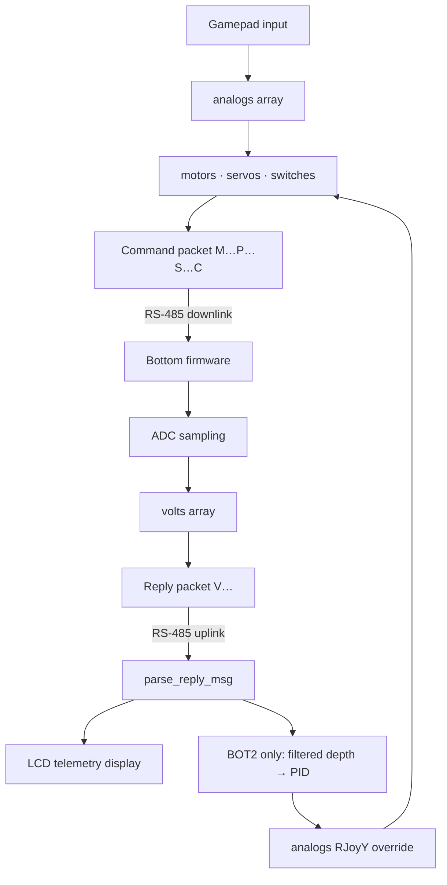

# System Architecture

NURC ROV firmware is split across four Arduino sketches on Teensy 4.x boards: two **top-side** (operator) programs and two **bottom-side** (vehicle) programs. BOT1 and BOT2 share the same overall ROVotron Cadet lineage but are **not interchangeable**; each pair must be flashed and operated together.

## High-Level Topology

## Subsystem Responsibilities

| Subsystem | Top Side | Bottom Side |
|-----------|----------|-------------|
| Operator input | Xbox gamepad via USB Host | n/a |
| Control mixing | Thruster/gripper/servo mapping | n/a |
| Depth hold (BOT2 only) | PID on filtered pressure telemetry | Sensor acquisition only |
| Communication | Command transmit, telemetry receive | Command receive, telemetry transmit |
| Actuation | n/a | ESC pulses, claw/camera/LED outputs |
| Display | 4×20 LCD telemetry | n/a |
| Safety | Telemetry timeout, PID disengage (BOT2) | Parse validation, ESC startup sequence |

## Control Flow

1. **Top side** runs a fixed **20 Hz** main-loop timer (`loopPeriod = 50000` µs).
2. Each tick: read gamepad → apply trims/mixing (and BOT2 assist features) → build ASCII hex command → transmit on `Serial1` (RS-485).
3. **Bottom side** continuously samples ADC channels, assembles incoming bytes until `\n`, immediately replies with a `V…` telemetry packet, then parses the command.
4. Valid commands update thruster ESCs and auxiliary outputs; invalid packets are discarded (actuators hold last good state on BOT2 bottom; BOT1 bottom behavior depends on parse success).

## Data Flow

## BOT1 vs BOT2 Architectural Split

| Area | BOT1 | BOT2 |
|------|------|------|
| Depth control | Direct right-stick vertical mixing | Top-side PID depth hold after stick release |
| Input shaping | Deadband only | Deadband + slew limits + slow mode |
| Gripper | Dual complementary PWM (bottom) | RC servo claw with rate limiting (bottom) |
| Command validation | Checksum not enforced (bottom) | Checksum enforced (bottom) |
| Switch (`S`) section | Sent by top; **not parsed by BOT1 bottom in current code** | Parsed on both sides |

## Timing and Initialization

- **Top**: CPU clock reduced to 100 MHz when ≥100 MHz (LCD compatibility). Splash screen ~1.5 s, then gamepad seek.
- **Bottom**: 12-bit ADC resolution; **7 s ESC arming delay** (BlueRobotics convention), brief forward pulse, return to neutral before accepting commands.
- **Telemetry smoothing**: Bottom-side exponential moving average on ADC reads (`smooth = 80` of `smoothRange = 100`).

## Shared Design Assumptions

- Neutral motor/servo command byte: **128** (`Pwm0`).
- Thruster ESC mapping: 0→1900 µs, 128→1500 µs, 255→1100 µs (inverted direction vs. byte value).
- Six logical motor channels (0 = gripper/claw, 1-2 = vertical, 3-4 = horizontal, 5 = strafe).
- Two servo channels in the protocol: index 0 = LED dim, index 1 = camera tilt (often disabled).

See also: [communication.md](communication.md), [control-systems.md](control-systems.md), [bot1-vs-bot2.md](bot1-vs-bot2.md).
