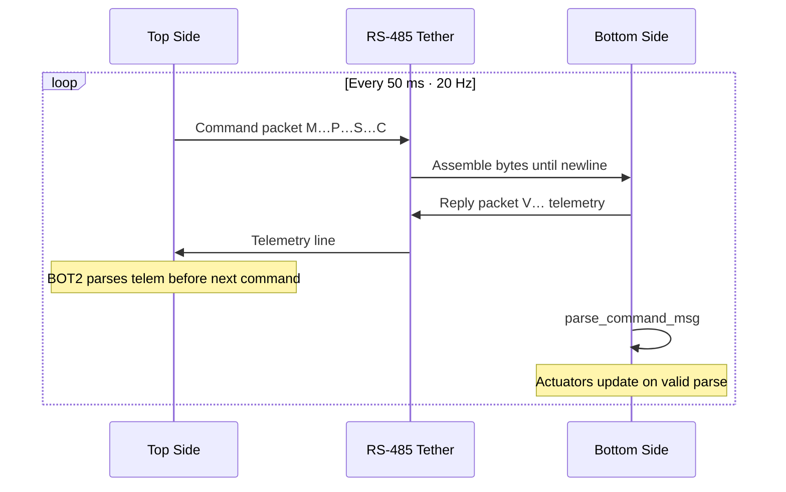

# Communication Protocol

Top-side and bottom-side firmware exchange **ASCII hex** packets over **RS-485** at **115200 baud** on Teensy `Serial1`. Transmit-enable is driven on **GPIO pin 2** (`SER_TXEN` / `TXE_PIN`).

## Physical Layer

- Medium: RS-485 half-duplex on one pair of an RJ45 tether cable
- Top: transmits commands on schedule; listens for telemetry asynchronously
- Bottom: replies with telemetry immediately upon receiving a complete command line, then parses the command

## Command Packet (Top → Bottom)

Packet layout:


Format string:

```
M<12 hex digits>P<4 hex digits>S<2 hex digits>C<2 hex checksum>\n\0
```

| Field | Width | Description |
|-------|-------|-------------|
| `M` | 1 char | Motor section marker |
| Motors | 6 × 2 hex | Motor bytes 0-5 (00-FF; 128 = neutral) |
| `P` | 1 char | Servo section marker |
| Servos | 2 × 2 hex | Servo bytes 0-1 |
| `S` | 1 char | Switch section marker (BOT2 bottom parses; BOT1 bottom **does not**) |
| Switches | 2 × 1 hex | Binary flags (Y button, B button on top) |
| `C` | 1 char | Checksum marker |
| Checksum | 2 hex | Sum of all motor + servo + switch bytes, mod 256 |
| `\n` | 1 char | Line terminator |

### Example

Neutral command (all 128 = 0x80):

```
M808080808080P8080S00C80\n
```

Checksum: `(0x80×6 + 0x80×2 + 0×2) % 256 = 0x80`.

### Motor Index Semantics

| Index | Role |
|-------|------|
| 0 | Gripper / claw |
| 1 | Left vertical |
| 2 | Right vertical |
| 3 | Left horizontal |
| 4 | Right horizontal |
| 5 | Strafe |

### Servo Index Semantics

| Index | Role |
|-------|------|
| 0 | LED brightness (PWM duty 0-255) |
| 1 | Camera tilt (servo/PWM; often held at neutral) |

## Reply Packet (Bottom → Top)

Packet layout:


Format string:

```
V<18 hex digits>\n\0
```

| Field | Width | Description |
|-------|-------|-------------|
| `V` | 1 char | Voltage/telemetry marker |
| Channels | 6 × 3 hex | Raw 12-bit ADC counts (000-FFF) |
| `\n` | 1 char | Line terminator |

**No checksum** on telemetry in either platform.

### Telemetry Channel Mapping

| Index | Measurement | Top-side scaling |
|-------|-------------|------------------|
| 0 | Battery divider | ×11 → volts |
| 1 | H2O temperature | `(V - 0) × (256/3.3)` → °C |
| 2 | Spare | `(V - 0.10) × 8` |
| 3 | LED temperature | `(V - 1.40) × 70` → °C |
| 4 | Spare | `(V - 1.40) × 71` |
| 5 | Pressure / depth | `(V - 0) × 90` → feet (BOT1 display); BOT2 uses dedicated depth filter |

Top converts hex to volts: `volts[i] = val × 3.3 / 4096`.

## Transaction Sequence



Steps in plain language:

1. Top sends command at 20 Hz (every 50 ms).
2. Bottom receives bytes until `\n`, null-terminates buffer.
3. Bottom calls `build_reply_msg()` and transmits telemetry **before** parsing the command.
4. Bottom parses command; on success, updates actuators.

BOT2 top parses telemetry **before** building the next command so PID uses fresh depth samples.

## Checksum Handling

**Top (both)**: Always computes and appends checksum.

**BOT1 bottom**: Checksum bytes are read but comparison is **commented out**; packets are accepted if structure parses.

**BOT2 bottom**: Rejects packet if `(computed_sum % 256) != received_checksum`.

## Failure Modes

| Condition | BOT1 behavior | BOT2 behavior |
|-----------|---------------|---------------|
| Malformed hex | Parse error; actuators not updated | Parse error; actuators not updated |
| Missing `\n` | Buffer fills; BOT2 resets pointer on overflow | Same |
| No telemetry | LCD may show stale values | Depth hold disabled after 1000 ms timeout |
| RS-485 noise | Partial messages discarded | Partial messages discarded |

## Top-Side Receive Path

- BOT1: Stores telemetry in `reply_msg`; parses on `\n`; always attempts display.
- BOT2: Bounds-checked buffer; parse updates depth filters and validity flags before PID.

## Bottom-Side Receive Path

- Assembles `command_msg` character by character.
- BOT2: Resets assembly pointer if buffer would overflow (`sizeof - 2`).

## Legacy Notes

- Original ROVotron documentation referenced `RVdataDescr.txt` (not present in this repository).
- BOT1 bottom parser structure predates the `S` section added on the top side. Treat this as a known integration risk when auditing BOT1 pairs.
