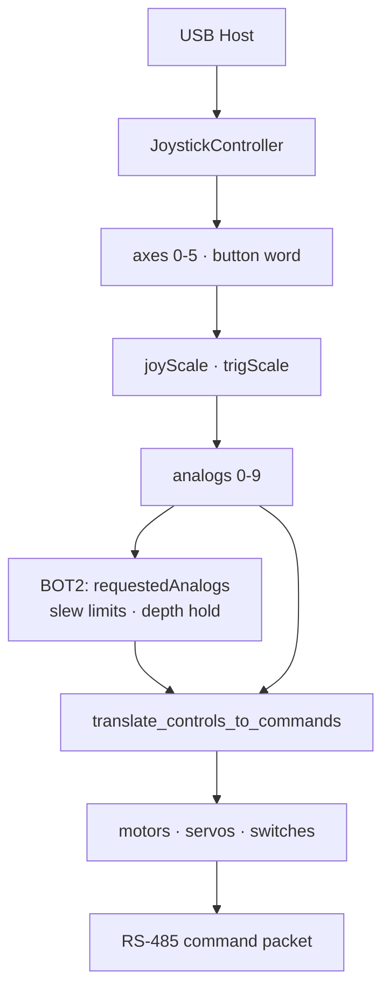

# Control Systems

Operator control flows from an **Xbox One gamepad** through top-side mixing logic to six motor bytes and two servo bytes in each command packet.

## Controller Input Flow



Main loop rate: **20 Hz** (`loopPeriod = 50000` µs).

## Gamepad Mapping

### Analog Sticks (after deadband scaling)

| Control | Index | Function |
|---------|-------|----------|
| Left stick X | `LJoyX` (0) | Strafe |
| Left stick Y | `LJoyY` (1) | Forward / aft |
| Right stick X | `RJoyX` (2) | Yaw / steer |
| Right stick Y | `RJoyY` (3) | Vertical (dive/surface) |
| Left trigger | `LTrig` (4) | Gripper open (BOT2 latched) |
| Right trigger | `RTrig` (5) | Gripper close (BOT2 latched) |

Deadband: **3000** raw units (~9% travel) before stick response.

### Synthesized Axes

| Index | Source | Function |
|-------|--------|----------|
| `DPadX` (6) | D-pad left/right (BOT2 also reads hat switch) | LED dim level |
| `DPadY` (7) | D-pad up/down | Camera tilt (when enabled) |
| `ButsX`, `ButsY` (8-9) | Face button pairs | Auxiliary rate axes |

### Buttons

| Button | Top-side use |
|--------|--------------|
| Y | `switches[0]` telemetry flag |
| B | `switches[1]` telemetry flag |
| LB + RB (BOT2) | Toggle slow mode on rising edge |

## Thruster Mixing

Common equations (signs adjusted per `motDirs[]`):

```
LRForeAft = LJoyY × DriveGainL + RJoyX × SteerGain
RRForeAft = LJoyY × DriveGainR - RJoyX × SteerGain
Strafe    = LJoyX × StrafeGain
LUpDown   = RJoyY × DiveGainL [+ pitchTrim on BOT2]
RUpDown   = RJoyY × DiveGainR [+ pitchTrim on BOT2]
```

Output: `motor = Pwm0 (128) + lims(analog × motDir × 128)`, clamped to ±127 offset.

### Motor Direction Trims

Both platforms use per-motor direction constants (`GripperMotDir`, `LUpDownMotDir`, etc.). **Strafe direction differs**: BOT1 `+1`, BOT2 `-1`.

### Gain Tables (defaults in code)

| Gain | BOT1 | BOT2 |
|------|------|------|
| DriveGainL | 0.50 | 0.60 |
| DriveGainR | 0.60 | 0.60 |
| SteerGain | 0.60 | 0.60 |
| DiveGainL/R | 0.60 | 0.60 |
| StrafeGain | 0.50 | 0.58 |
| GripperGain | 0.50 | Step-based (not gain) |

## Gripper Control

### BOT1

```
Gripper = (RTrig - LTrig) × GripperGain
```

Bottom splits motor 0 into complementary PWM on pins 9 and 10.

### BOT2

Triggers increment/decrement a latched `gripperCmd` by `GRIPPER_STEP × trigger` when above `GRIPPER_TRIGGER_ON` (0.18). Bottom maps motor 0 to claw servo with slew limiting.

## Servo / Auxiliary Outputs

| Servo | Source | Output |
|-------|--------|--------|
| 0 | `DPadX` | LED dim PWM |
| 1 | `-DPadY` (BOT1) or neutral (BOT2) | Camera tilt |

## Slow Mode (BOT2 Only)

- Toggle: **LB + RB** simultaneously (edge-triggered).
- Effect: 40% stick command scale; reduced acceleration and deceleration rates.
- LCD row 0 shows `Slow Mode: ON/OFF`.

## Input Slew Limiting (BOT2 Only)

`limitRateOfChange()` caps per-loop delta on horizontal and vertical stick commands:

| Mode | Accel | Decel |
|------|-------|-------|
| Normal | 2.5 /s | 6.0 /s |
| Slow | 1.0 /s | 3.0 /s |

Sign reversals force deceleration to zero before reversing.

## Depth Hold (BOT2 Only)

See [pid-depth-hold.md](pid-depth-hold.md). When active, PID replaces manual `RJoyY`; slew limiting skips vertical axis while hold is engaged.

## Operator-Facing LCD

Displays battery, depth, temperatures (BOT1) or slow mode, battery, depth, PID status (BOT2). USB device VID:PID shown on connect for gamepad identification.
