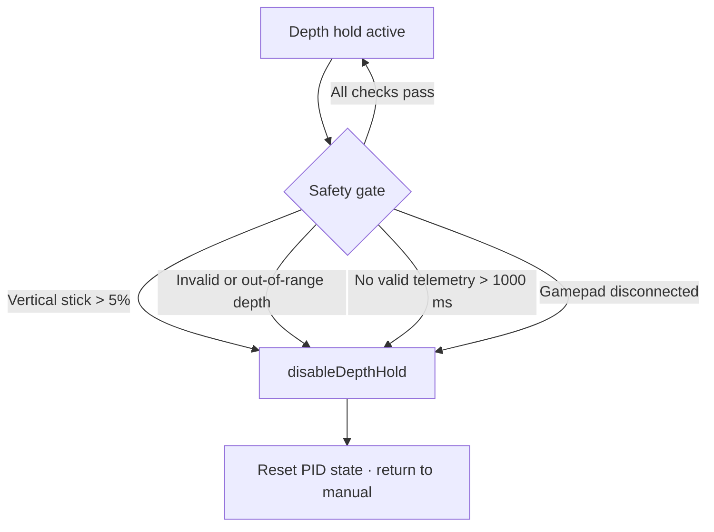

# Safety and Failsafes

This document describes safety-relevant behavior **as implemented** in the current firmware. It is not a substitute for operational procedures, pool rules, or competition safety requirements.

## Communication Loss

### Top Side

| Platform | Behavior |
|----------|----------|
| BOT1 | Continues transmitting last computed commands at 20 Hz; no explicit comm-loss motor shutdown on top |
| BOT2 | Depth hold disabled if telemetry invalid or **> 1000 ms** since last valid sample; horizontal commands continue |

### Bottom Side

| Platform | Behavior |
|----------|----------|
| BOT1 | `stop_all_motors()` exists but is **not** called on timeout in `loop()`; last valid actuator state persists |
| BOT2 | Tracks `lastGoodPacketMs` but no automatic neutral on timeout in current `loop()`; invalid packets skip `applyActuatorCommands()` |

**Operational note**: Neither bottom sketch implements a tether watchdog in the reviewed code. Loss of commands leaves thrusters at last good ESC setpoint until power cycle or new valid packets.

## Invalid Packet Handling

### Structure Errors

Parse returns non-zero if:

- Section markers (`M`, `P`, `S`, `C`) missing or out of order
- Hex digits invalid
- Terminator not `\n` + `\0`

**BOT2 bottom**: Rejects packet; thrusters not updated for that frame; claw still updated via `applyClawOutput(motors[0])` each loop (uses last parsed motor 0 value).

**BOT1 bottom**: Same skip-on-error pattern when parse fails.

### Checksum

| Platform | Checksum enforced? |
|----------|-------------------|
| BOT1 bottom | **No** (comparison commented out) |
| BOT2 bottom | **Yes**: `(sum % 256) must match `C` field |

### Buffer Overflow

BOT2 top and bottom reset receive pointer if buffer would exceed `sizeof(msg) - 2`. BOT1 top has no bounds check on telemetry assembly.

## PID Disengagement (BOT2)

`disableDepthHold()` runs when:

Disengagement resets integral, derivative state, and hold output.

## Sensor Validation (BOT2)

`depthTelemetrySampleValid()` rejects:

- Pressure < 0.05 V or > 3.25 V
- Depth < -2 ft or > 250 ft

Invalid reading sets `depthTelemetryValid = false` and disables hold.

## Startup Behavior

### Top Side

1. Reduce CPU clock to 100 MHz if needed (LCD).
2. Initialize motors/servos to neutral (128).
3. Splash screen 1.5 s.
4. Begin USB host and 20 Hz command timer.

No explicit "wait for gamepad before transmit" gate; neutral commands sent immediately.

### Bottom Side

1. Attach ESC and actuator pins.
2. **7 second** neutral delay (ESC calibration/arming).
3. 1 second forward pulse (1600 µs) on all thrusters.
4. Return to neutral (1500 µs).
5. BOT2: initialize claw and safe neutral on dim/camera.

Thrusters should not be in water during ESC arming sequence.

## Gripper Safety

| Platform | Mechanism |
|----------|-----------|
| BOT1 | `GripperGain = 0.50` comment: "keep from breaking the plastic"; dual PWM limiting |
| BOT2 | Trigger deadband 0.18; latched position; claw slew max 80 µs/20 ms; pulse clamp 1000-2000 µs |

## ESC / Thruster Safety

- Neutral command: 1500 µs.
- Command clamp on top: ±127 from center (lims).
- Invalid parse: bottom does not call motor writes (holds ESC at previous µs value).

## Controller Disconnect

BOT2: `joystickConnected()` checks USB driver active flags; depth hold disabled when false. Stick commands may freeze at last slew-limited values until reconnect.

## Switch Section

`switches[0]` and `[1]` carry Y/B button states. Not consumed by bottom actuators in current code.

## Recommendations for Operators

1. Always pair matching top/bottom firmware (BOT1 or BOT2).
2. Verify gamepad connection before entering water.
3. BOT2: confirm depth hold OFF when manually piloting near obstacles.
4. Power-cycle bottom board after prolonged comm loss if thrusters do not return to neutral.
5. Complete ESC arming sequence dry before first immersion.

## Known Gaps (Repository State)

1. BOT1 protocol mismatch: top sends `S` section; bottom parser may not accept packets (verify in field).
2. No bottom-side comm timeout → neutral thrusters.
3. BOT1 checksum validation disabled.
4. Camera tilt disabled on BOT2. Verify mechanical camera is secured.
